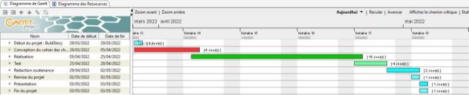
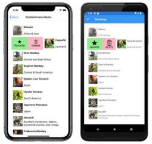

# BuldOry
Projet Xamarin – LPDAM 2021 – 2022 

**Application Xamarin – BuldStory** 

Réalisé par : DI MARTINO Jonathan & FESTOC Mylan 

1 Contexte et définition du problème 

Les monuments historiques sont de nos jours une culture, une passion, un événement.   

Pour faciliter la vision de tous ses beaux monuments, une carte sera à la disposition pour tous les utilisateurs afin de visualiser l’endroit exact de chaque monument.  

Chaque utilisateur pourra mettre en favoris le ou les monuments qu’ils souhaitent en se connectant sur notre application.  

Un système d’inscription et de connexion sera mis en place. Pour chaque monument il y aura une description détaillée avec des informations complémentaires. 

2 Objectifs

Conception d’une application en Xamarin utilisant les éléments abordés pendant les séances et une utilisation d’une architecture MVVM. 

Celle-ci prendra en compte les contraintes des fonctionnalités qui ont été données. 

3 Périmètre 

L’application sera à tout type de public 

À travers l’application tous les monuments historiques du monde seront présentés. 

4 Description fonctionnelle des besoins 

1. Besoins fonctionnels  

L’application doit comporter différentes fonctionnalités pour que l’utilisateur ait par la suite l’envie de visiter les monuments qu’il préfère. 

Une carte (Map) sera disponible pour visualiser tous les monuments historiques, une interaction avec celle-ci sera disponible pour permettre à un utilisateur de l’ajouter dans les favoris ou bien de visualiser plus d’informations concernant le monument sélectionné. 

Une partie connexion, inscription pour que l’utilisateur ne perde pas les monuments placés dans ses favoris, l’utilisateur et ses favoris seront enregistrés dans une base de données. 

La partie favoris permettra de voir les monuments que l’utilisateur a mis en favoris, un compteur indiquant le nombre de personnes ayant ajouté ce monument en favoris sera visible. 

La partie information d’un monument sera présente pour donner encore plus envie à l’utilisateur de visiter ce monument. 

2. Besoins non fonctionnels 

Les besoins non fonctionnels représentent les exigences implicites auxquelles le système doit répondre.  

Pour le bon fonctionnement de notre projet, les besoins non fonctionnels sont les suivants : 

- Interface ergonomique et intuitive 
- Une carte avec les monuments n’ayant très peu ou pas de temps de réponse (niveau latence, optimisation) 

5 Contraintes 

- Architecture MVVM 
- Persistance de certaines données 
- Utilisation d’une API externe 
- Utilisant des fonctionnalités natives (Custom Renderer et Dependency Service)  
- Utilisation d’une navigation avancée (TabbedPage, SideMenu) 

6 Délais 

7 Architecture Logicielle 

8 Résultats possibles ou attendus 

